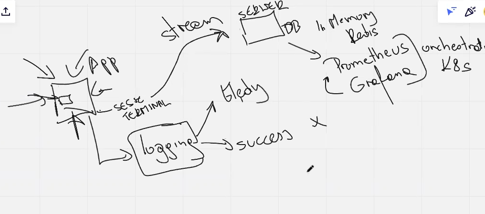
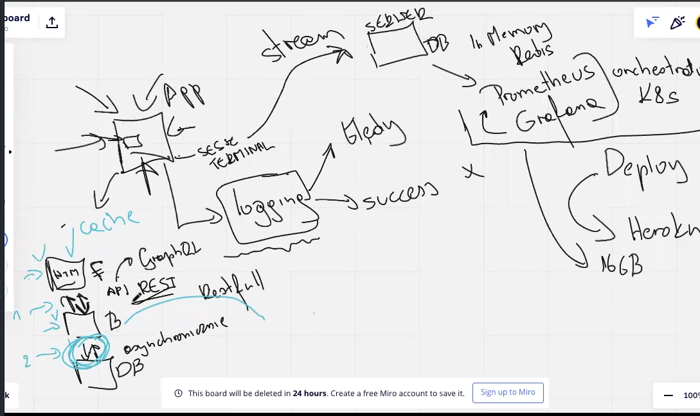
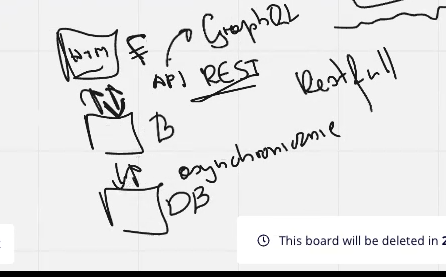

#logging

1. błędy aplikacji chcemy mieć w pliku tekstowego
2. system logowania w terminalu wysyłamy streamem
3. stream do systemu
4. np. nowy serwer - DB - in memory np. REDIS
### patrz obrazek
5. 5.Darmowe narzędzie: Premeteusz + Grafana
   - Prometeusz - ściaga dane
   - grafna - wizuwalizuje
   - orchestrator - zarządza aplikacjiami np. K8s or REDHAT (drogi w chujjj)

6. Deplpy aplikacji:
    - heroku (cloud)

7. Musthave w django:
   - Front
   - backend
   - datebase
   - API Rest - do łączności Front i Backend, (inne: GraphQL od google)
     

co to jest cache ?

pamieć podręczna, przeglądarka i django ma swój cache
django może zwracać z cacha zamiast wysyłać zapytanie z DB

czego się używa do cacha ?
bazy dane in memory (np. REDIS)

Memoizing ?

zasada programowania funkcyjnego 
pure function zwraca zawsze to samo — czyli jak wychodzi to samo to po co funkcja ma za każdym wyliczać :D
zeby to zrobić robimy decoratory

Logging to taki pamiętniczek :)

Memorizing — powiadomienie o błędach itp

